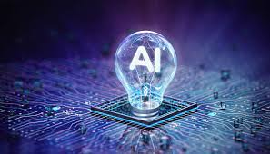

## I. Introduction

Artificial Intelligence, otherwise known as AI, are machines that simulate human intelligence, learning, and decision-making. Over the years, AI has become more prevalent in education. Colleges, and maybe some high schools, have been implementing more lessons and even classes about AI. Students all over the world are being taught about the usage of AI, building of AI systems, ethics of AI, and so much more. AI is also changing the way students learn. In this age of AI, more and more students by the day aren't doing their homework by themselves anymore. Wether it's to save time or they are incapable of answering a question, all they have to do is prompt the AI for a solution and they get a decently reliable answer. Homeworks, quizzes, and exams are the usual measurement for a student's capabilities. AI hinders these measurements because there is always a chance such student is not answering it themselves. On the bright side, another way students use AI is when studying or learning a new topic. They would prompt the AI questions they have about a topic they learned and AI would give semi-reliable information about any question they have. Throughout ICS 314, and some of my other courses, I have used tools such as ChatGPT, GitHub Copilot, Gemini, and Claude. They have been useful for explaining difficult concepts, brainstorming ideas, and identifying errors in my thought process.

## II. Personal Experience with AI:

### 1. Experience WODs e.g. E18
For experience WODs, I would rarely use AI. I would use the Experience WODs as a chance to learn on my own. If I did use AI during these assignments, I would usually use them for debugging and for a deeper understanding on the task given. I thought it was best to try to learn on my own as these experiences were not on a time crunch. It would also be useful for the in-class WODs as I can save time by not asking AI and just start implementing on my own.

### 2. In-Class Practice WODs
For the In-Class Practice WODs I would usually use them in setting up my page. In almost every single one of the later, prisma included, WODs I would have trouble in initializing my database. In the earlier WODs I would use AI as a tool to debug and make sure that I met the requirements of the WODs. If I had forgotten how to implement something or there was a function that was on the tip of my tongue, I would use AI as a little boost.

### 3. In-Class WODs
There is not much of a difference in AI usage from practice WODs and real WODs. I would generally use them for debugging, help in implementation, initializing database, etc. The amount of prompts on the other hand did differ. I would use less AI on the In-Class WODs because we were on a time crunch and wanted to spend more time coding than sending prompts. There were also times where AI would give me weird suggestions. There were many situations where I just had to pass up on AI completely and figure it out myself.

### 4. Essays
For essays, I do not just put the whole prompt and ask it to make an essay for me. Same with the code I write in class, I would use AI to check if there were any spelling or grammar errors. Other than that, from time to time I would use AI to help me express my thoughts more clearly. These essays ask for my opinion and not AIs so I don't really see the point in using AI anyways.

### 5. Final Project
During the final project, AI had become my best friend. I asked a lot of questions on how to implement something, and how to fix bugs within my code. It was my first full-scale project and I wanted it to look great and AI had made the process 1000x times easier. The most common type of bug was usually a bug that had to do with pulling from my database. The GitHub CoPilot extension helped a lot as it could look at the entirety of my code and pinpoint the reason a function isn't pulling correctly. Though, I will say, that some of the changes AI suggested were very large scale, and sometimes even harmful. The GitHub CoPilot extension would make changes to maybe 3-4 files everytime it was called to implement something. This made merging into main especially difficult. I had stopped using AI for large changes ever since and decided that I would rather take a chunk out of my day solving it myself.

### 6. Learning A Concept / Tutorial
As I have said many times before, AI has become very useful in teaching me concepts. Many times throughout the experience and practice WODs I would ask a lot of why and what questions. These questions would help me understand the functions that I'm builidng at a deeeper level.

### 7. Answering A Question In Class Or Discord
I never really used AI for this purpose. I would only speak if I the thing I had to say, I was 100% confident in.

### 8. Asking Or Answering A Smart Question
Again, I never used AI for these purposes. Most of the time, if someone is asking the Discord, then that means they had already asked AI about their issue at hand. If AI was not able to answer their question, 60% of the time I don't think I could give a better answer.

### 9. Coding Examples
I never used AI for this purpose speficially, sometimes in requestion a function it would give an example of another similar function.

### 10. Explaining Code
In most of the experience WODs, after trying them on my own time and turning them in, I would redo them and follow the tutorial. In following the tutorial I may look at a few functions and then question AI as to how an implementation works and why someone may design it this way.

### 11. Writing Code
Throughout the course, I did have AI write snippets of my code. I would usually try to give it my idea, almost a pseudocode of some sort to help it. I made sure to not ask to "just build ___" though as I did want to have a learning experience still.

### 12. Documenting Code
AI would sometimes write its own documentation for the functions that I ask for help in implementing. I believe this is just to clarify to me that it is doing what it was asked to do. If it's simple, I may have kept it, I would have much rather just documented myself though.

### 13. Quality Assurance
There were times where I would put my code through an AI prompt and asked about the issues. To debug, I would ask where the source of the problem is located, or I would ask for functions that I may be forgetting about, that could help me get closer to the solution.

### 14. Other Uses In ICS 314 Not Listed
I believe everything listed already covers all the AI usage through within the course.

## III. Impact on Learning and Understanding.
I believe AI has its ups and downs on my learning experience. I believe that it saved a lot of time, and that I still learned a lot. I tried to make sure that in all the situations of using AI, that I at least learned something from it. Though, I will say that AI has made me a little lazy within this course. Sometimes I wouldn't look at myself for debugging, rather I would use AI to do that for me. I would occassionally have to give myself a wake-up slap and start doing it myself as at the end of the day I am paying for the college's education, not AIs.

## IV. Practical Applications
I know AI has a lot of practical applications in the real world. I believe it was the NVIDIA CEO themselves saying that they expect their employees to use AI. I also know that AI is putting a lot of entry-level software engineers out of jobs as their jobs can usually be done by a senior engineer's prompts. At least, that's what is rumored to be happening to the Software Engineering job market. I also think that there are many coders who are just starting out and using the AI for their personal projects, just like me. So, it's not just the highest of the highs that are using AI but also the lowest of lows.

## V. Challenges and Opportunities
Well one of the biggest challenge with AI is accuracy. AI has a much smaller scope than I had previously thought, and I believe that sometimes we may be over-reliable on the information it provides. There has not been a day, whether its on my other classes' assignments or an ICS 314 assignment, that AI has been 100% correct. I would always have to correct something after an implementation and give my touch to make sure that the function AI gives actually works. Like I said before homeworks, tests, and exams are our measurements, AI also raises questions on how a student should be tested within this course. Despite the challenges, AI presents opportunities for education like no other tool, I would argue, ever since the internet. It allows for instantaneous feedback, assistance in debugging code, and even explains topics to you based off of prior interactions. 

## VI. Comparative Analysis
I will say there is no other teaching like traditional teaching methods. AI can be only so useful and so specific. I think the humanly interactions between a student and teacher can never be replicated. Now, traditional teachings with AI on the side, I think I can get behind. AI is just such a useful tool and I don't think it will go away any time soon. I do think schools in the future, will start preparing for this kind of side-to-side implementaiton, and it will go more into a hybrid where AI to teach is encourage more. I assume this kind of implementation of learning will be similar to that of this class.

## VII. Future Considerations
I think there will be much more courses on AI in the future, maybe even a major in AI. I know that this major exists in some schools, but maybe it shows up more frequently. I think AI grading systems will be more frequent. I know that one of my current professors use AI to check the files we send, to make sure we all participated in our weekly classwork. I also believe AI can only advance from here on out so that the information will be more and more accurate. I think the challenges will come from ethics, and how far we may actually take it before some deem it "out of hand". I think we are still far from 100% accuracy.

## VIII. Conclusion
To conclude, I believe AI usage within this course has been a roller coaster. It had its ups and downs, but overall I will say that it has been a net positive experience. AI can help those learn quicker and improve their understanding, but I call for those in the future to not take their solutions 100% to heart and consider yourself first. Understand when, where, and why you are using it.
