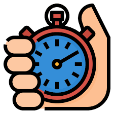

## How Long Will I Take?
The way in which I estimated the amount of effort a task would take was for the most part using my gut and old assignments. I noticed that historically I take more time on assignments that include UI design. Now that I had no more template or goal, I imagined that I would take even longer than those previous assignments. Not only that, I would have to think and imagine what I actually want my website to look at which adds a little more time as, of course, I want it to look as good as it possibly can. This long time of brainstorming did end up coming in handy because it made implementation way faster.

## Benefits of Tracking
Even though my estimates were often inaccurate, usually it would take me much longer than anticipated, doing the estimation in advance still helped. It allowed me to allocate time of my day beforehand so, even if I did go over, I would be prepared. It also allowed me to view the project through different scopes. For example, I wanted to start on my courts UI but realized that I needed much more time to refine our Prisma schema and make adjustments. Estimating allowed me to identify dependencies early, like needing the database finalized before frontend integration in the example above.

## How Good Is Estimating Really?
Tracking effort was semi-useful I would say. As said above, they were often inaccurate, and it made no difference in how much actual time I spent on the project. Though, it did help because it made me realize how much more time I actually need to do the future assignments, that’s why I said SEMI-useful. Other than assisting in pattern recognition, effort estimation didn’t really do that much.

## 100% Effort
To track my efforts, I would usually look at the starting time and then by the time I am finished I would mentally track that I spent X amount of time on this task. I would also use the time between my commits to help me mentally keep track of how much time in between the changes I made to the given repo. During the start of the project, I would sometimes use a timer/stopwatch while working on an isolated task. This was not perfectly consistent, especially when I switched between tasks or got interrupted and had to do something else. I would keep time in mind, but not make it the sole driver of productivity.

## Changes
If I were to make changes in my tracking methods, I would do something more exact. I would like to more consistently log start and end times. This way I can get a better image of how long tasks actually take instead of guessing. Gut can only take you so far and that’s why most of my estimations were really off. Taking estimation from something that is intuition-based to data-driven can help me get a better picture as to what is actually achievable in a certain time frame, and would be a really good habit to learn.

## AI Use
During the building of this project, I used tools such as ChatGPT, Claude, and Copilot to assist with a multitude of tasks. Tasks such as helping to understand concepts at a deeper level, debugging issues, deployment, and generating snippets of codes for certain implementations. Usually I would take 10 minutes of prompt engineering to make sure that the AI helps me with all the cases I need for implementing the feature I want to implement. Generation time would take around 1 minute per prompt. After that, debugging would take around an hour to 1 hour and a half to make sure that everything is working the way it is supposed to be working. A lot of my prompts were just copying and pasting some of the errors I got and saying “help me debug this”. This saved a lot of time as I did not have to look for the error myself which would have taken much longer. Most AI-generated code would not go through without a screening. If the code was okay and good to work for the website, I would allow the code to be changed, if not, then I would have to manually make changes so that what I had envisioned comes to life. AI assisted more in speed than accuracy in some situations. 
