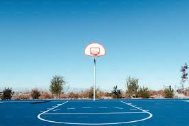

## Overview
The problem: There are some people who have a passion for basketball and want to explore new courts. When looking for courts on a regular map application, they are not given information about who is there, the condition of the court, which courts are present and recent news about the area.

The solution: This project provides a database for these passionate basketball players to use when finding a court and people to play basketball with. There they will get the answers they are looking for when finding their dream place to play. 

## Collaborators
<ul>
  <li>Coby Preza</li>
  <li>Enoch Pangaribuan</li>
  <li>Jacob Maier</li>
  <li>Dexter Chung</li>
</ul>

## Mockup Page Ideas:
### Courts Database:
<ul>
  <li>Amount of courts</li>
  <li>Amount of people there</li>
  <li>Amount of people it can hold</li>
  <li>Condition of court</li>
  <li>Recent news about the surrounding area</li>
</ul>

### Player Profiles:
<ul>
  <li>"Check in" at the court</li>
  <li>Level of skill(user input)</li>
  <li>Player description</li>
  <li>Friends and communication system</li>
  <li>Players in your area</li>
  <li>Choose between shooting around and looking for game</li>
</ul>

## Case Ideas
<ul>
  <li>Open app looking for court to go to</li>
  <li>Home Courts / Look for Courts tab to choose the court your going to that day</li>
  <li>Looking for Group Tab where the user can find other profiles to play with</li>
  <li>Profile Tab to customize user's personal profile</li>
</ul>

## Beyond
<ul>
  <li>Interactive Map</li>
  <li>QR Code to check in at a court</li>
  <li>Leaderboard system for the players</li>
  <li>Court and player rating system</li>
</ul>
