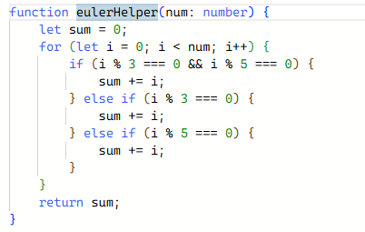

## First Impressions
I have heard of most programming languages. TypeScript, on the other hand, has somehow flown right past my radar. Though, after spending some time with it and learning about it, I think that it's honestly one of my favorite languages. I mean I've tried C, C++, Java, and Python but something about TypeScript stands out to me. Maybe it was the background in all those languages, but learning this language was definitely the easiest in my opinion.

For example, in comparison to Java, it didn't take me a particularly long time to get used to. TypeScript felt a lot less demanding in both syntax and code structure. Java, at the start, demands types, classes, and structure. TypeScript lets you be a lot more fluid and, though it's safer to do so, does not need an explicit declaration of type to work. Also, with TypeScript, it felt a lot easier to transfer my thoughts into code.

## Ups and Downs?
I already expressed a lot of my feelings about this question beforehand, but I will say that I think that the language is good. Like I said before, TypeScript does not demand type inference. This flexibility allows for a lot of time to be saved as it gives us one less thing to worry about. It also makes the code much more readable for the average person. Types, as it did for me, made learning how to program a hassle. Types in Java, the first language introduced in ICS 111, are very strict and the terminal or IDE is very quick to notify you of that. 

Though this flexibility is great, it allows for complacency. Starting on TypeScript without learning the value types hold in a program is a huge caveat in my opinion. I am very grateful for my foundation to be built in Java even if the learning curve was harsh. In bigger programs, types are an absolute necessity. Unless you want a messy and hard-to-debug program.

## WOD am I doing here?
In ICS 314(Software Engineering), we are introduced to Workout of the Day, or WOD for short. This is where we are given a problem, a little background, and then are asked to solve such problem. I believe that WODs, at least for me, are extremely useful in the teaching of a language. Going into class on the day of a WOD is very nerve-racking, but that pressure is key to taking it to the next level in my opinion. It simulates a realistic situation as we will rarely have all the time in the world to do something. For example, a technical interview. Even though these WODs scare me, I will say that the satisfaction of having solved the problem before the blaring alarm sounds is tough to beat. I am both excited and scared for the ones to come.
