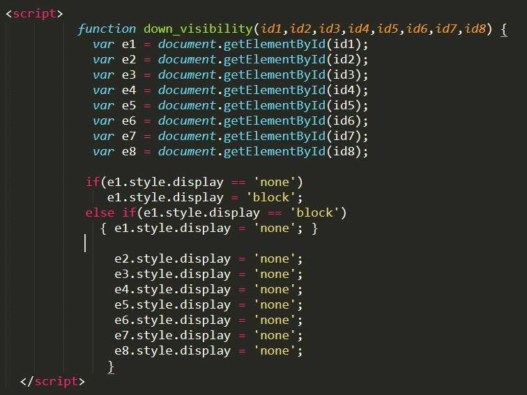
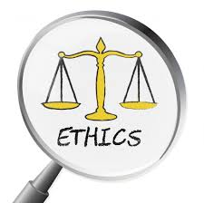

## How It Sounds To Us
Coding standards are a set of rules and guidelines that developers follow when writing their code. This allows for consistency, readability, and maintainability. Examples in coding standard may include naming conventions, formatting rules, and organizational practices. It may even go beyond practices such as these but also implementation in items such as objects, references, etc. 

One of the tools we used throughout the course to help reinforce these rules is ESLint. ESLint reviews JavaScript (and TypeScript) code to find problems and enforce coding standards. It does this by scanning for items such as syntax erros, unused variables, inconsistent formatting, and even bug-causing patterns. It allows for a lot of the issues of building applications to be caught in the earlier stages.

Coding standards go beyond web application by teaching us about human coordination. In any team environment, consistency should be one of the pivotal factors you and your teammates should strive for. For example, imagine your company hires a new software engineer. They open up the source code to see code written without standards. None of it is consistent and it's hardly readable. They are unable to identify what the function "vxy" does or what variable "u27" is. There also no comments to be found. How can one expect for the new hire to get work done if they have no idea what is doing what? Coding standards help solve these problems so that if a new hire does come to your company, they should know exactly what's going on upon first glance.

## When Code Meets Consequences
Ethics in software engineering refer to the principles and responsibilities developers have to abide by when creating their software. The code they develop have to be safe, fair and respectful to not just the users but to all of society. Writing code is not just about making the most efficient or correct code. Writing code also involves the acknowledgement of the impact your code has on the outside world. Issues like user privacy, data security, acessibility, and avoiding harmful biases within your algorithms. All of such have to be considered when building, no exceptions or compromises. For example, in building your web application, make sure user data is collected, stored, and maybe shared safely. Also have the user be completely aware of the stakes and consequences when doing such.

Ethics don't just apply to web application development, but any kind of development. Software is embedded in many parts of everyone's lives whether they know about it or not. Areas such as healthcare, justice, finance, etc. can directly affect the safety and fairness of many. For example, if you are making a face recognition application, make sure the user knows that they are being scanned. Also make sure to let the user know what kind of information is being stored about them, whether they are allowed to delete that information, and whether that information is being shared to others or not. Everyone lives by a different ethical code, the algorithms we build should be no different.