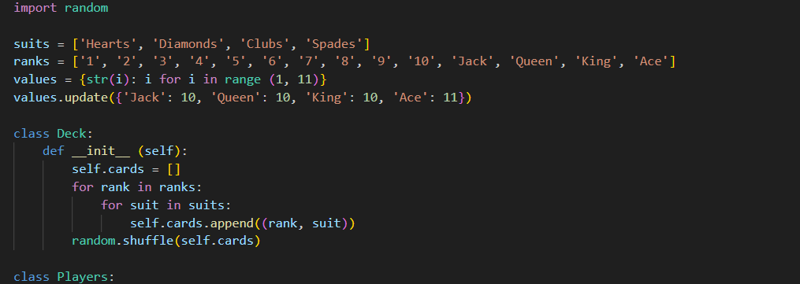

 
If you have not heard of blackjack here's a simple rundown. There are two roles: the player(s) and the dealer, each with their own set of ruels that we will get into later. To begin, you and any other players are dealt two cards face up. The dealer is also assigned two cards, but only one is visible to the players. 

The number cards all follow their face value. The jack, queen, and king all represent 10s. The ace on the other hand, is special as it represents either 1 or 11, depending on which value you think is better for your hand. After you are given your cards, you add them up and see if they are equal to or less than 21. If you get exactly 21, congratulations, you can only tie or win! 

Though, if you don't get 21, you must choose whether to hit, which gives the player another card, or to stand, which ends your turn. If you hit and your total goes over 21, then that means you bust and you automatically lose. Once all the players have played out their turn, the dealer plays last.

Currently you can only play this game via the terminal, but I do plan to epxand it into a Discord bot in the future. I also hope to add a betting function with a server-wide currency system. I think it would be fun to experiment with this and see how my friends react, even though the currenty isn't real. While I know I have a lot more to come, I am excited to keep improving both my project and my skills.

Here's what a run of the code looks like for now:

<pre>
Player's Hand: [('6', 'Diamonds'), ('9', 'Spades')] Total: 15
Dealer's Shows: ('3', 'Diamonds')
Hit or Stand? (h/s): h
Player's Hand:  [('6', 'Diamonds'), ('9', 'Spades'), ('King', 'Clubs')] Total:  25
You busted! GG, Dealer wins!
Play again? (y/n): 
</pre>

