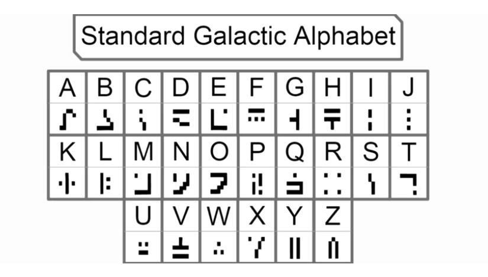

 
I am in Grey Hats of the University of Hawai'i at Manoa. Basically, Grey Hats is a Registered Independent Organization(RIO) that focuses on cybersecurity. In Grey Hats you are given the opportunity to join a multitude of teams in a multitude of different competitions. I decided to join the National Cyber League team as I heard it was a good foot in the door for cybersecurity.

The National Cyber League had many different categories that correlate with different parts of cybersecurity. Here's a list of them:
<ul>
  <li>Open Source Intelligence</li>
  <li>Cryptography</li>
  <li>Password Cracking</li>
  <li>Log Analysis</li>
  <li>Network Traffic Analysis</li>
  <li>Scanning & Reconnaissance</li>
  <li>Web Application Exploitation</li>
  <li>Enumeration & Exploitation</li>
</ul>

In the picture above, you may recognize it if you are an avid gamer, you can see the "Standard Galactic Alphabet". This is most famously used in the game "Minecraft". More specifically, it is found in the game's "Enchantment Table" where players can use experience gained throughout the game to amplify their items. In one of the problems in the Cryptography section, we are asked to find the translation of Pop-Culture languages. Having played the game for a long time, I instantly recognized the language, and was able to quickly get our team a few points. This problem stood out to me as I never thought I would see a Minecraft reference in a national competition.

From this experience, I learned a lot about the field of cybersecurity. It helped that it was a competition as I did not want to let my teammates down and I wanted to help as much as I possibly could. This motivated me to spend time on my own to learn and practice the categories beforehand so I can perform just as my team needs. In the end, out of the 4 teams that participated from our school, we placed the best nationally. I accredit our little win to our teamwork, perseverance, and adaptability. This was a great introduction to the world of cybersecurity and I look forward to doing more competitions again this year.
