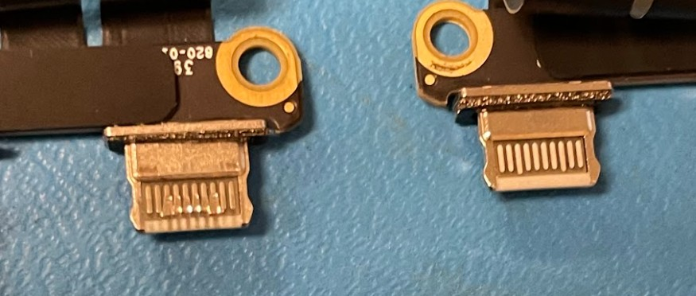

I work at the University of Hawai'i at Manoa Bookstore TecHub. As part of my job, we are asked to get certifications that would allow us to work on Apple products, specifically Mac laptops. Throughout the course we are taught the ins-and-outs of the devices we would be working on. We are also taught the procedures for handling computer repairs which is our primary service. We also help with Windows installations, Adobe installations, data transfers.

Our department works as a team. First, there's someone who initializes the repair. Before we even receive the device, the customers would have completed a form through our website. This form tells us their problem with the device and their contact information. If the customer decides to come on a whim, then we can complete the form with their assistance. Then, either this or the next technician can make a repair sheet which serves a note-taking tool for all technicians in the department to be able to use. After that a technician can troubleshoot the laptop to see the kind of damages we can confirm. This can be done in a multitude of ways such as running diagnostics, tests, or even just opening the laptop up. Any technician can do any part of the process, and I have had experience in every part.

First and foremost, through this experience I learned the functions of each computer part and the way the interact with each other. I also learned about the tests we as technicians are able to run and utilize as tools to assist us with diagnosing. This job has also taught me valuable troubleshooting and problem solving skills. Often, we are not given the whole picture, so we must dive deeper to find the root problem. With this caveat comes patience and a willingness to learn through trial and error. Based on of my coworkers' anecdotes, I don't think I have had the worst of it yet, but I am excited to learn and explore all that this job has coming. 
